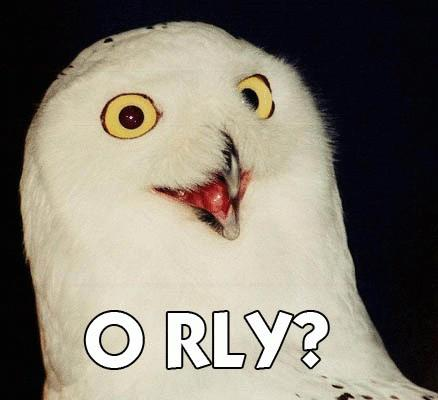
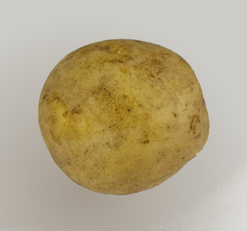

Introduction to Spatial Data
============================

the *Geographic Data problem*

or

**Spacial is Special**

___

## GEO Problem?

You have to deal with data that has special rules.

Rules based on a reality not told in schools

---

## Earth is not a sphere

You have been told that the Earth is a sphere

___

## Earth is not an orange

If you are lucky you have heard the history that tells that the Earth has [the shape of an Orange](https://en.wikipedia.org/wiki/French_Geodesic_Mission#Background)

___

## Earth is more like a potato

___

## Earth has the shape of a potato

Belive me, I know what I'm talking about

___

## Earth is a Geoid

___

## Geoids are physical

Although its the true shape of the Earth, we can't measure over it.

___

## For measuring we need mathematics

We need an **Ellipsoid**

___

## Ellipsoid vs Geoid

On average, they are quite similar

___

## Datum is the name of the game 

The Ellipsoid and a couple more of things is what we call:

### the **DATUM**

(And there are not one but several Datums, understanding this takes several courses of Geodesy, trust me on this)

___

## Earth is not a sphere: Conclusion

*Remember*

> The **GEO** information lays over something *mathematical* that has its own rules.

> **THE DATUM**

---

## Maps are flat

Have you ever notice that a map / your screen monitor is **Flat**

___

## Making things flat

But you can't turn **flat** something espherical

(without breaking it)

___

## Breaking Flat

You have to choose what you want to *break*:

* **Areas**
* **Angles**
* **Distances**

In the best case you can choose two of the three.

(I'm skipping several courses on Cartography with this slide, trust me on this)

___

## Choose your weapon!: The Projection

The cartographers have some tricks for breaking things **mathematically**

___

## Maps are flat: Conclusion

*Remember*

> The **GEO** information uses a *mathematical* trick to make things **flat** orderly.

> **THE PROJECTION**

---

Geodata types (raster and vector)
====================================

---

OGC Simple Feature Acess data model
====================================

---

lon/lat versus lat/lon
====================================

