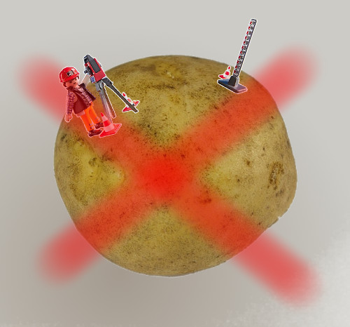
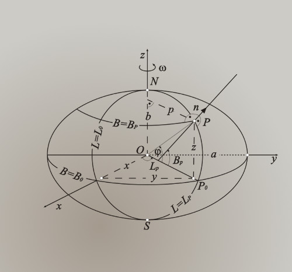

Introduction to Spatial Data
============================

**Spacial is Special**

or

the Geographic data problem

___

## GEO Problem?

You have to deal with data that has special rules.

Rules based on a reality not told in schools

---

## Earth is not a sphere

You have been told that the Earth is a sphere

___

## Earth is not a sphere

If you are lucky you have heard the history that tells that the Earth has [the shape of an Orange](https://en.wikipedia.org/wiki/French_Geodesic_Mission#Background)

___

## Earth is not a sphere

But the Earth has the shape of a potato

___

## Earth is not a sphere

Belive me, I know what I'm talking about

___

## Earth is not a sphere

This is what we call a **Geoid**

___

## Earth is not a sphere

Although its the true shape of the Earth, we canno't measure over it.

___

## Earth is not a sphere

We need an **Ellipsoid**

___

## Earth is not a sphere

The Ellipsoid and a couple more of things is what we call it the **DATUM**

(Why there are not one but several Datums takes several courses of Geodesy, trust me on this)

___

## Earth is not a sphere

Remember

> The **GEO** information lays over something *mathematical* that has its own rules.

> **THE DATUM**

---

Maps are flat (projections)
====================================

---

Geodata types (raster and vector)
====================================

---

OGC Simple Feature Acess data model
====================================

---

lon/lat versus lat/lon
====================================

